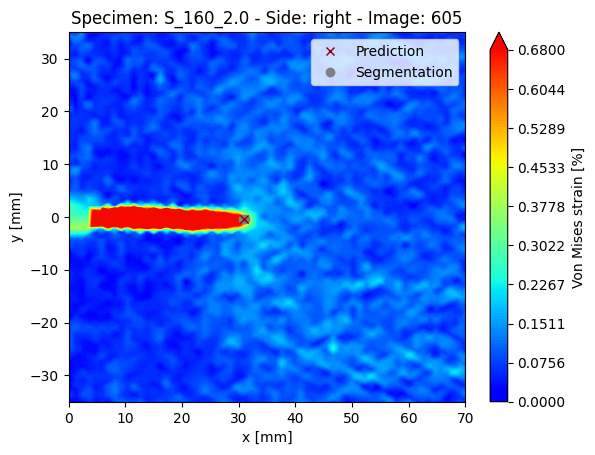
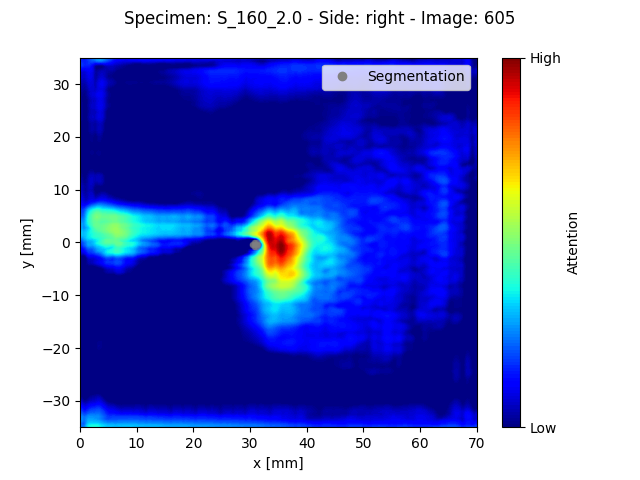
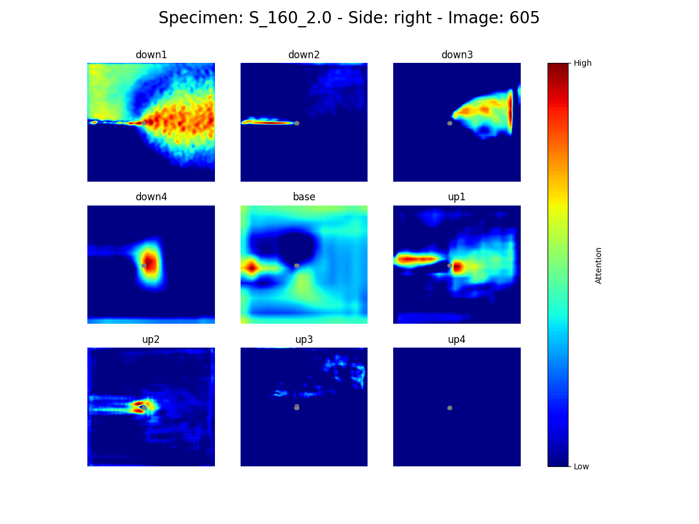

# Explainable machine learning for precise fatigue crack tip detection
[](https://zenodo.org/badge/latestdoi/499013011)

This repository contains the code used to generate the results of the research article
```
D. Melching, T. Strohmann, G. Requena, E. Breitbarth. (2022)
Explainable machine learning for precise fatigue crack tip detection. 
Scientific Reports.
DOI: 10.1038/s41598-022-13275-1
```
The article is open-access and available [here](https://doi.org/10.1038/s41598-022-13275-1).

## Abstract
*Data-driven models based on deep learning have led to tremendous breakthroughs in classical computer vision tasks and have recently made their way into natural sciences. However, the absence of domain knowledge in their inherent design significantly hinders the understanding and acceptance of these models. Nevertheless, explainability is crucial to justify the use of deep learning tools in safety-relevant applications such as aircraft component design, service and inspection. In this work, we train convolutional neural networks for crack tip detection in fatigue crack growth experiments using full-field displacement data obtained by digital image correlation. For this, we introduce the novel architecture ParallelNets – a network which combines segmentation and regression of the crack tip coordinates – and compare it with a classical U-Net-based architecture. Aiming for explainability, we use the Grad-CAM interpretability method to visualize the neural attention of several models. Attention heatmaps show that ParallelNets is able to focus on physically relevant areas like the crack tip field, which explains its superior performance in terms of accuracy, robustness, and stability.*

## Dependencies
*  [Python 3.8.5](https://www.python.org/downloads/release/python-385/)

All additional, version-specific modules required can be found in *requirements.txt*
```shell
pip install -r requirements.txt
```

## Usage

The code can be used to produce attention heatmaps of trained neural networks 
following these instructions.

### 1) Data
In order to run the scripts, nodal displacement data of the fatigue crack propagation experiments
S<sub>950,1.6</sub> and S<sub>160,2.0</sub> as well as the *nodemap* and ground truth data
of S<sub>160,4.7</sub> is needed. 
The data is available on [Zenodo](https://zenodo.org) 
under the DOI [10.5281/zenodo.5740216](https://zenodo.org/deposit/5740216). 

The data needs to be downloaded and placed in a folder `data`.

### 2) Preparation
Create training and validation data by interpolating the raw nodal displacement data to arrays of size 2x256x256, 
where the first channel stands for the x-displacement and the second for the y-displacement.
```shell
make_data.py
```

### 3) Training, validation, and tests
To train a model with the ParallelNets architecture, run
```shell
ParallelNets_train.py
```
To test a model for its performance, run
```shell
ParallelNets_test.py
```
after training.

### 4) Explainability and visualization
You can plot the segmentation and crack tip predictions using
```shell
ParallelNets_plot.py
```


and visualize network and layer-wise attention by running
```shell
ParallelNets_visualize.py
```



The explainability method uses a variant of the Grad-CAM algorithm [[1]](#1).

## References
<a id="1">[1]</a> 
Selvaraju et al. (2020).
Grad-CAM: Visual Explanations from Deep Networks via Gradient-Based Localization. Int. J. Comput. Vis. 128, 336-359.
